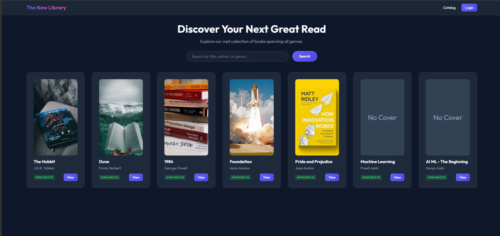
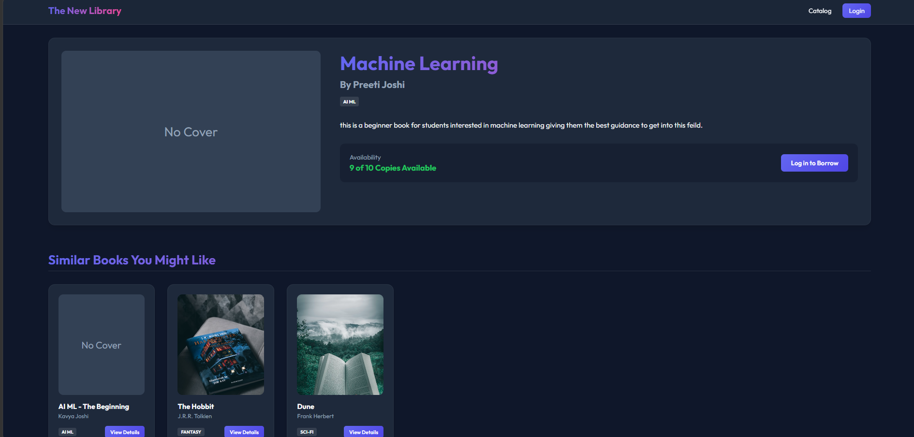

# 📚 The New Library

A full-stack l**ibrary management system** built using FastAPI, SQLite, SQLAlchemy, and Jinja2 templates. The application supports authentication, book borrowing, admin management, and AI-powered book recommendations.

---

## ✨ Features

- 🔐 **Secure Session Authentication:** Robust user authentication with password hashing (via `bcrypt` + `passlib`) and JWT access tokens stored securely in HTTP-only cookies. Includes inline login and registration validation error reporting.
- 🔍 **Glassmorphic Instant Search:** Fast catalog query filter directly on the home page for real-time searching of titles, authors, or genres.
- 📖 **Smart Book Details:** In-depth book information displays with availability badges, and a custom context-aware **"Similar Books You Might Like"** recommendation slider showing other titles in the same genre or by the same author.
- ⚡ **Interactive Borrow & Return:** Real-time transaction handling, tracking remaining catalog stock, and history recording for borrowed materials.
- 🔮 **AI Personalized Picks:** User dashboards pull historical borrowing data and send it directly to OpenAI's GPT models via advanced prompt engineering to return custom reading suggestions.
- 🛡️ **Role-Based Admin Area:** Secure area allowing verified administrators to add brand-new books directly into the catalog.

---

## 🛠️ Tech Stack

- **Backend:** [FastAPI](https://fastapi.tiangolo.com/) (Python)
- **Database / ORM:** SQLite + [SQLAlchemy ORM](https://www.sqlalchemy.org/)
- **Frontend Templates:** [Jinja2](https://jinja.palletsprojects.com/) + Vanilla CSS (CSS variables, Custom HSL palettes, outfits typography)
- **AI Integrations:** [OpenAI API](https://platform.openai.com/) (GPT Models)
- **Authentication:** JWT tokens + Hashing

---
## Screenshot
### Home Page


### books Page



## 🚀 Getting Started

### 1. Prerequisites
Ensure you have **Python 3.8+** and **Git** installed on your machine.

### 2. Clone and Navigate
```bash
git clone <your-repository-url>
cd library_system
```

### 3. Setup Virtual Environment & Dependencies
Create a virtual environment and install the required modules listed in `requirements.txt`:

```bash
# Windows PowerShell
python -m venv venv
.\venv\Scripts\activate
pip install -r requirements.txt

# macOS / Linux
python3 -m venv venv
source venv/bin/activate
pip install -r requirements.txt
```

### 4. Configure OpenAI API Key (Optional)
To activate live AI recommendations on the dashboard, configure your OpenAI key as an environment variable before launching the server:

```bash
# Windows PowerShell
$env:OPENAI_API_KEY="your-api-key-here"

# macOS / Linux
export OPENAI_API_KEY="your-api-key-here"
```
*Note: If no key is set, the application automatically falls back to beautiful pre-loaded placeholder suggestions, ensuring the UI remains perfectly functional.*

### 5. Seed the Database
Initialize and populate your local SQLite database (`library.db`) with test accounts and sample library books:
```bash
python seed.py
```

### 6. Run the Dev Server
Launch the FastAPI reload server:
```bash
uvicorn main:app --reload --host 127.0.0.1 --port 8000
```
Open **[http://127.0.0.1:8000](http://127.0.0.1:8000)** in your favorite browser to explore!

---

## 🔑 Pre-seeded Test Accounts

You can log in instantly using the following test credentials:

| Role | Username | Password | Access |
| :--- | :--- | :--- | :--- |
| **Regular User** | `john` | `password` | Borrow/return, AI dashboard recommendations |
| **Administrator** | `admin` | `admin123` | Access Admin area, append new catalog entries |

---

## 📂 Project Structure

```text
library_system/
│
├── static/
│   └── css/
│       └── style.css          # Premium modern dark styling
│
├── templates/
│   ├── base.html              # Base template with glass navbar
│   ├── search.html            # Main home page / search catalog 
│   ├── book_detail.html       # Book detail view & Similar Books list
│   ├── login.html             # Login form with inline error alerts
│   ├── register.html          # Register form with confirmation validation
│   ├── user_dashboard.html    # Borrowed books & AI recommendation panel
│   └── admin.html             # Secure catalog insertion form
│
├── ai_recommendation.py       # OpenAI prompt engineering & GPT connectors
├── auth.py                    # JWT authentication & password crypt
├── database.py                # SQLAlchemy DB engine & session setup
├── models.py                  # User, Book, and BorrowHistory schemas
├── schemas.py                 # Pydantic schemas for verification
├── seed.py                    # Database seeder utility
├── main.py                    # FastAPI route mappings and controllers
├── requirements.txt           # Main python dependency manifest
└── .gitignore                 # Standard file exclusion layout
```
## Future Improvements
```
postgreSQL integration
Email notifications
Deployment on Render/Railway
```
## Author
```
Prachi Bagasi
```
